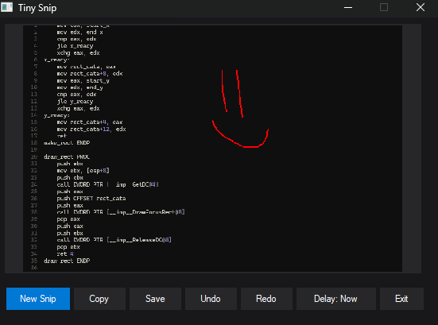

# Tiny Snip

A tiny 2504 byte Windows snipping tool written in 32-bit MASM assembly.



## Features

- Region capture with 0, 3, or 5-second delay
- Sharp preview and automatic clipboard copy
- Red pen with eight-level Undo/Redo
- PNG, JPEG, and BMP saving
- Compact custom dark interface
- Escape or right-click to cancel

## Build

Requires Visual Studio 2022 C++ Build Tools, Windows SDK, and Crinkler 3.0a on
`PATH`.

```bat
build.bat
```
